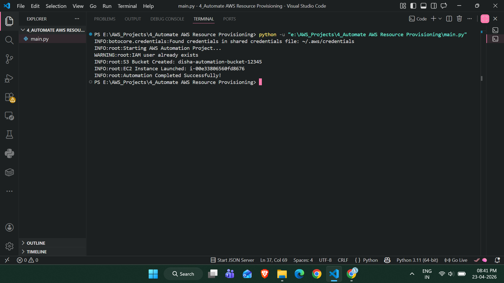
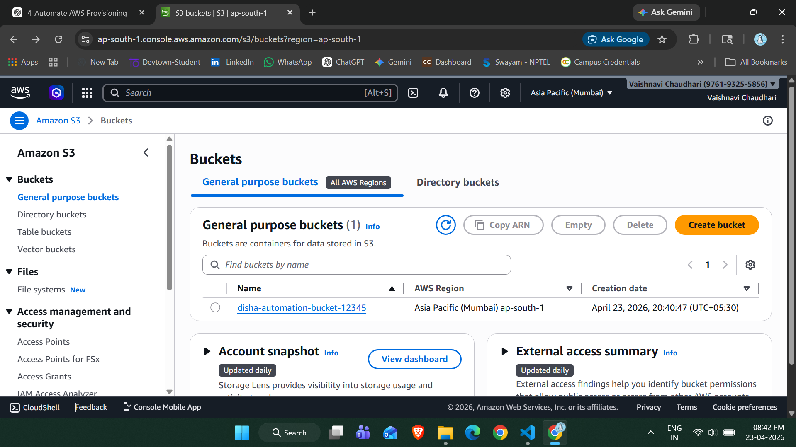
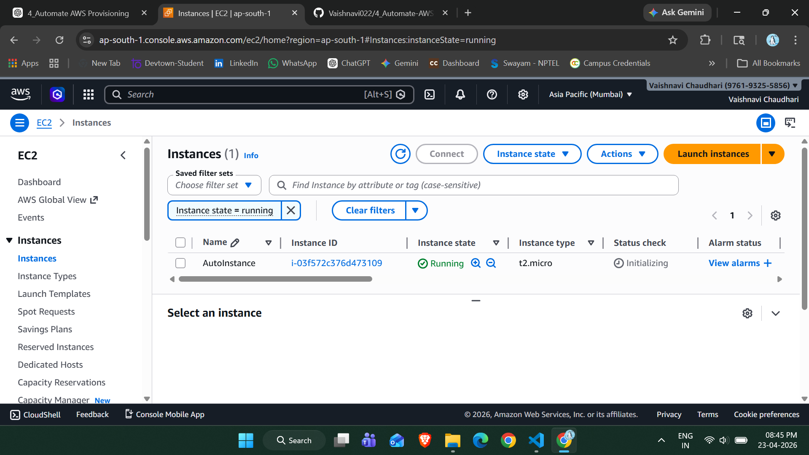

# 🚀 AWS Resource Automation using Python (boto3)

## 📌 Project Overview

This project automates the provisioning of AWS resources using Python and boto3.
Instead of manually creating resources through the AWS Console, this script creates them automatically.

---

## 🎯 Objective

* Automate AWS infrastructure creation
* Reduce manual effort
* Implement basic DevOps practices

---

## 🧰 Technologies Used

* Python 🐍
* boto3 (AWS SDK for Python)
* AWS Services:

  * IAM
  * EC2
  * S3

---

## ⚙️ Features

✔ Create IAM User
✔ Create S3 Bucket
✔ Launch EC2 Instance
✔ Logging & Error Handling
✔ Resource Tagging

---

## 🏗️ Architecture

Python Script → boto3 → AWS APIs → Resources Created (EC2 + S3 + IAM)

---

## 📂 Project Structure

```
aws-automation-project/
│
├── main.py
├── requirements.txt
├── README.md
└── images/
    ├── terminal-output.png
    ├── s3-bucket.png
    └── ec2-instance.png
```

---

## ⚙️ Setup Instructions

### 1️⃣ Install Dependencies

```bash
pip install -r requirements.txt
```

---

### 2️⃣ Configure AWS CLI

```bash
aws configure
```

Enter:

* AWS Access Key
* AWS Secret Key
* Region: ap-south-1
* Output: json

---

### 3️⃣ Update Code

Modify in `main.py`:

* Bucket name (must be unique)
* Key pair name

---

### 4️⃣ Run the Script

```bash
python main.py
```

---

## 📸 Project Output

### 🔹 Terminal Output



---

### 🔹 S3 Bucket Created



---

### 🔹 EC2 Instance Running



👉 **Final Output:** EC2 Instance successfully launched and running.

---

## 💡 Key Learning Outcomes

* AWS Automation using boto3
* Infrastructure as Code (basic)
* Cloud resource management
* DevOps fundamentals

---

## 🔥 Future Enhancements

* Add CLI input support
* Auto-delete resources (cost optimization)
* Integrate with CI/CD pipeline
* Use Terraform

---

## 👩‍💻 Author

Disha
AWS & DevOps Enthusiast 🚀
